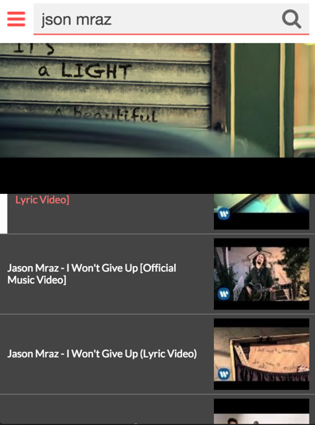

# Tubehead

[](https://travis-ci.org/makotot/Tubehead)
[](https://github.com/makotot/Tubehead)
[](https://github.com/makotot/Tubehead)

> YouTube music player as OSX app hardly inspired by [musictonic](http://musictonic.com/)


## Screenshot



## Download

Latest version of this app for osx can download from [here](https://github.com/makotot/Tubehead/releases).

## Develoment

```sh
$ npm install
$ npm run start
```

## License

MIT
